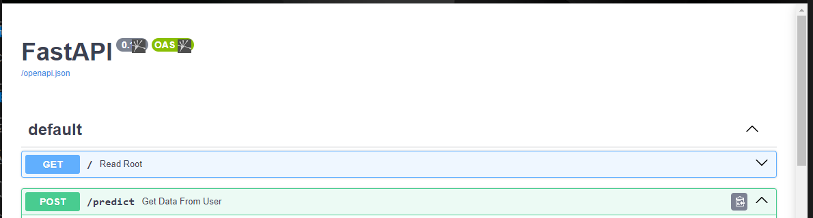
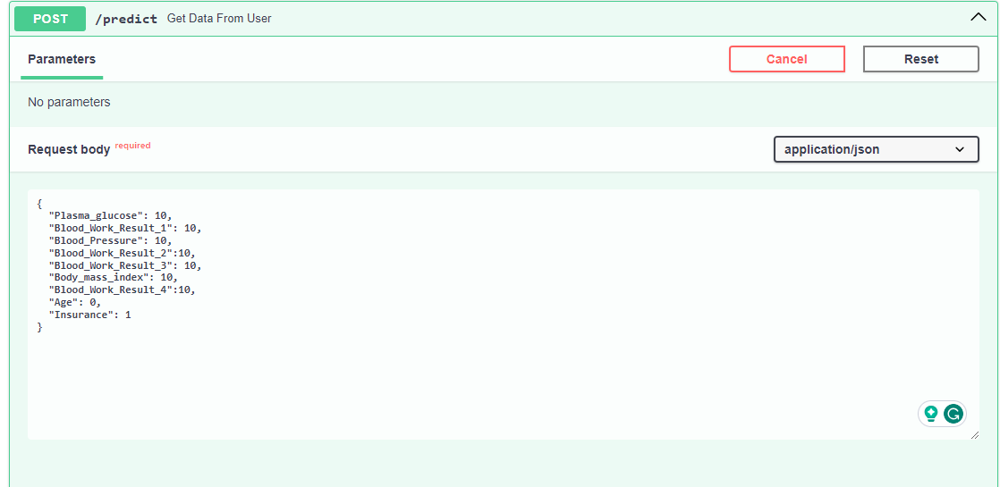
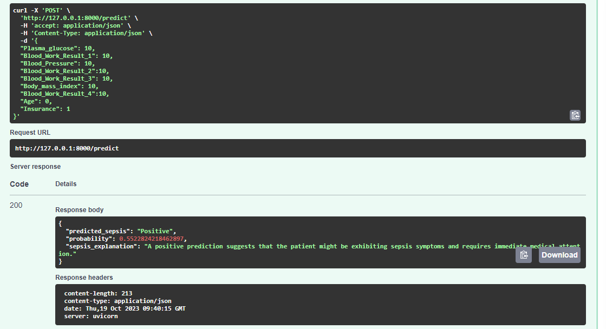

# Embed_ML_Model_Web_App 🚀

This project is centered around integrating a Machine Learning model into a web application using FastAPI, complete with Dockerization and deployment on Hugging Face. The core objective is to create a predictive model for assessing sepsis risk in ICU patients, thereby augmenting the abilities of healthcare professionals via an easily accessible online platform.

[](https://www.python.org/downloads/release/python-311/)
[](https://opensource.org/licenses/MIT)
[](https://jupyter.org/)
[](https://huggingface.co/my-awesome-ml-web-app)

## 📖 Overview

This project aims to:

- Embed a Machine Learning model into a user-friendly web application.
- Integrate advanced ML algorithms and models for interactive use.
- Dockerize the application for easy deployment.
- Deploy the app on Hugging Face for accessibility.

## 🔍 Preview

Below is a preview showcasing the app's appearance.

<div style="display: flex; align-items: center;">
    <div style="flex: 33.33%; text-align: center;">
        <p>Top</p>
        
    </div>
    <div style="flex: 33.33%; text-align: center;">
        <p>Middle</p>
        
    </div>
    <div style="flex: 33.33%; text-align: center;">
        <p>Bottom</p>
        
    </div>
</div>

## 🛠️ Technologies Used

- [FastAPI](https://fastapi.tiangolo.com/): A modern, fast (high-performance) web framework for building APIs.
- [Docker](https://www.docker.com/): Containerization platform for packaging applications.
- [Hugging Face](https://huggingface.co/): An AI research organization providing models and resources.
- [Python 3.11](https://www.python.org/downloads/release/python-311/): The programming language used for development.

## 🚦 Installation

To install and run this project, follow these steps:

```bash
# Clone the repository
git clone https://huggingface.co/spaces/petermutwiri/Sepsis_API

# Change directory
cd Embed_ML_Model_Web_App

# Install dependencies
pip install -r requirements.txt

# Run the FastAPI application
uvicorn main:app --reload
```

## 🚀 Usage

Here's how you can use the project:

1. Access the web application at [http://localhost:8000](http://localhost:8000) in your browser.
2. Interact with the ML model through the user-friendly interface with features like the patients : Plasma glucose level,Body mass index,Blood pressure levels etc

## 📄 Documentation

For detailed documentation and API usage, visit [http://localhost:8000/docs](http://localhost:8000/docs) after running the app locally.

## 📦 Dockerization

First create a Dockerfile, check documention : [Docker Official Documentation - Dockerfile reference](https://docs.docker.com/engine/reference/builder/)

Dockerize the application with the following commands:

```bash
# Build the Docker image
docker build -t app_name-app .

# Run the Docker container
docker run -p 80:80 app_name-app
```

## 🌐 Deployment

The APP was further deployed on huggingface. You can interact with the app via huggingface following the steps below.

### Usage Instructions

To access the sepsis prediction app, you will need to be signed in to Hugging Face:

1. If you don't have a Hugging Face account, you can sign up for free at [Hugging Face](https://huggingface.co/signup).
2. After signing in, you can access the app using the following URL:
   🤖[https://petermutwiri-sepsis-api.hf.space](https://petermutwiri-sepsis-api.hf.space)

Please note that you need to be signed in to Hugging Face to utilize this service. If you encounter any issues or have questions, feel free to checkout the huggingface documentation [Huggingface Documentation](https://huggingface.co/docs) for assistance.

<!-- gr8testgad-1-sepsis-prediction.hf.space -->

## Author

| Name | Article Link | Github |
| ---- | ------------ | ------ |
|Peter Mutwiri   |[Predictive Medicine: Building a Sepsis Prediction API for Early Intervention](https://medium.com/@mutpeet/title-predictive-medicine-building-a-sepsis-prediction-api-for-early-intervention-4e2a136a64c3)              |[Peter Mutwiri](https://github.com/PETERMUTWIRI)        |
|      |              |        |
|      |              |        |

## 📝 License

This project is licensed under the [MIT License](LICENSE).

## 🤝 Contributing

Contributions are welcome! Feel free to open an issue or submit a pull request.

## Acknowledgement 🥇

I would like to express my gratitude to the [Azubi Africa Data Analyst Program](https://www.azubiafrica.org/data-analytics) for their support and for offering valuable projects as part of this program. Not forgeting my scrum masters on this project [Rachel Appiah-Kubi](https://www.linkedin.com/in/racheal-appiah-kubi/) & [Emmanuel Koupoh](https://github.com/eaedk)

## 📧 Contact

For questions or feedback, please contact [Peter Mutwiri](mutpee@gmail.com).
